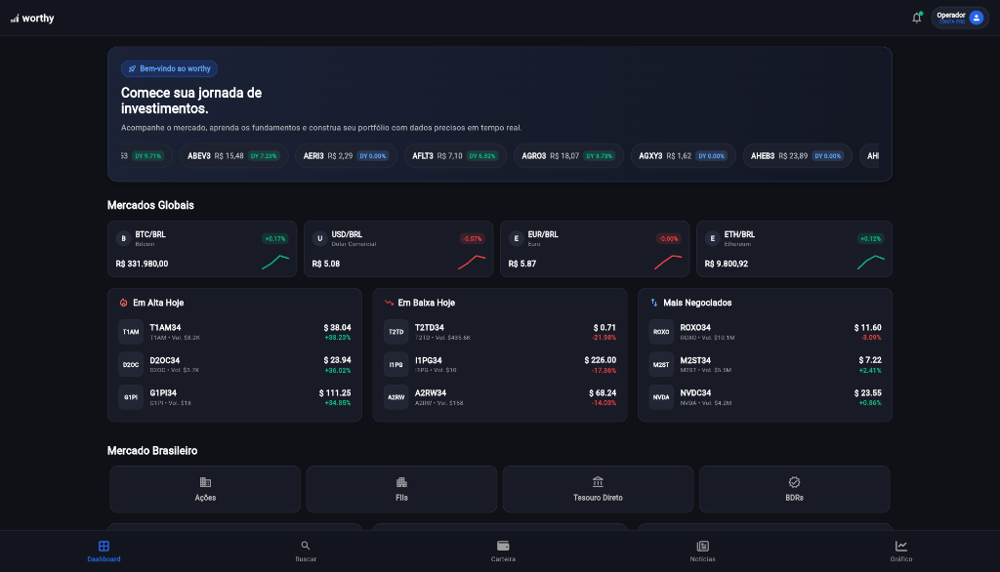
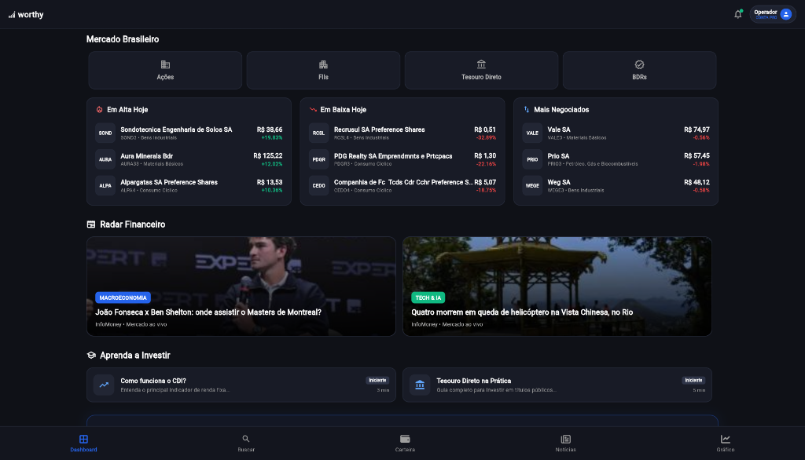
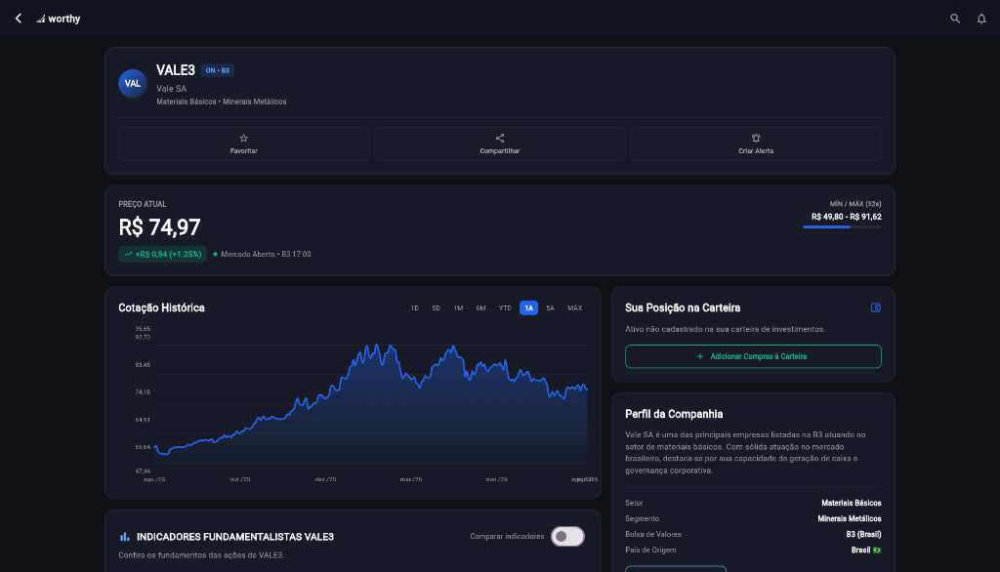
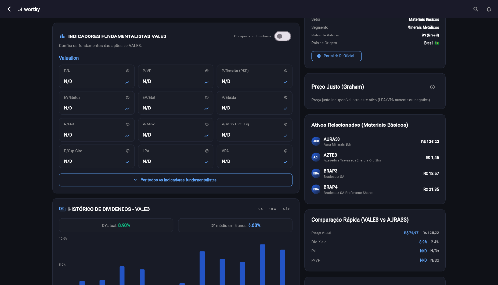
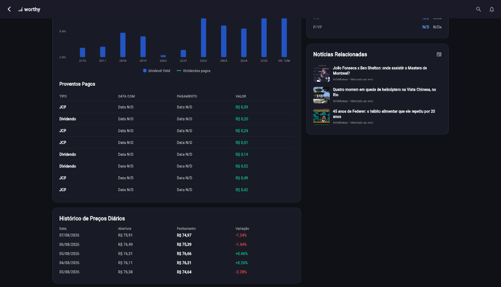
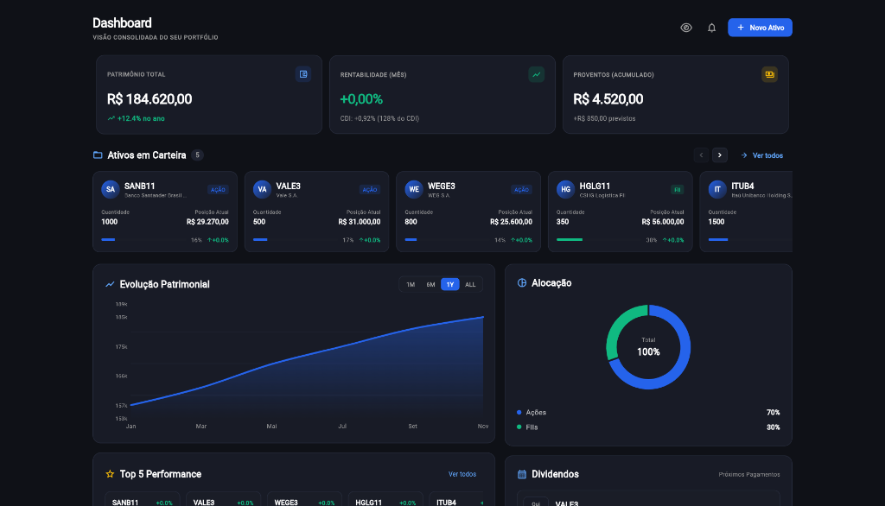
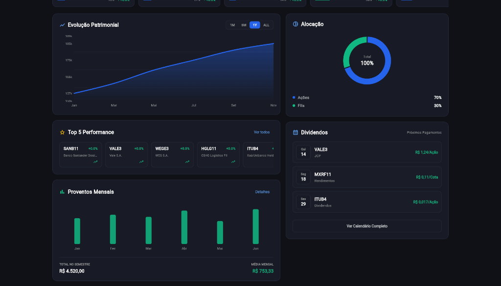
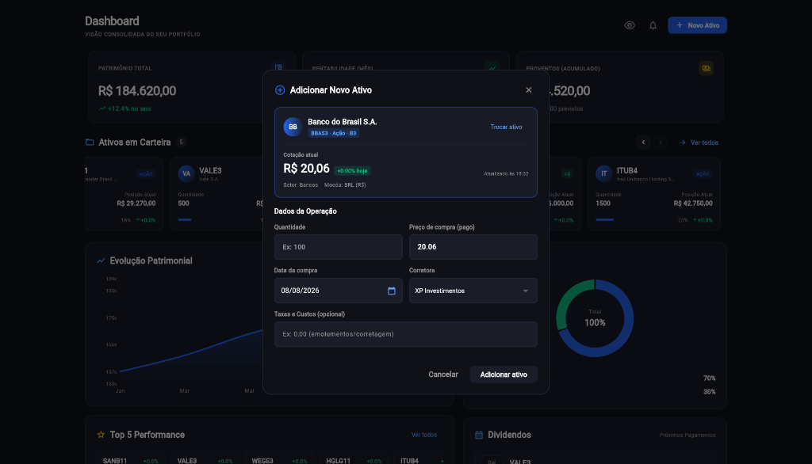
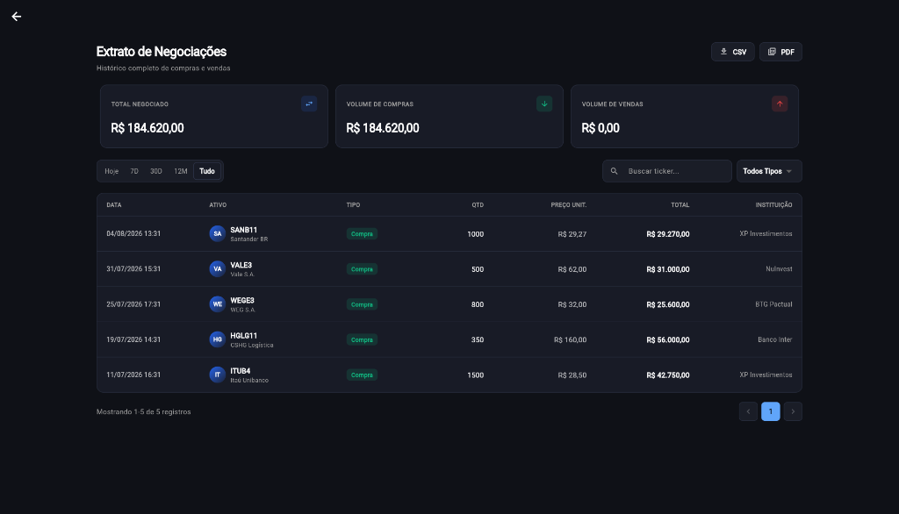

<div align="center">
  
  
  # Finance Control Flutter
  
  **Plataforma Completa de Gestão, Portfólio e Inteligência Financeira para Ações, FIIs, Criptomoedas e Renda Fixa**
  
  [](https://flutter.dev)
  [](https://dart.dev)
  [](https://www.sqlite.org/)
  [](https://pub.dev/packages/provider)
  [](LICENSE)
</div>

---

## 📌 Sobre o Projeto

O **Finance Control Flutter** é uma aplicação financeira multiplataforma (Web, Desktop e Mobile) projetada para centralizar a gestão de patrimônio, histórico de negociações e inteligência de mercado em uma única experiência moderna, reativa e sem dados fictícios.

### 🎯 Problema que Resolve
No cenário atual, investidores gerenciam ativos fragmentados entre diversas corretoras, bancos e carteiras. A aplicação unifica:
- **Consolidação de Posições**: Cálculo dinâmico de preço médio ponderado, alocação percentual e rentabilidade a partir do histórico real de ordens.
- **Extrato de Negociações Unificado**: Registro perene de compras, vendas e proventos com filtros temporais, busca instantânea e exportação CSV.
- **Inteligência de Mercado em Tempo Real**: Cotações ao vivo da B3, variação diária, gráficos históricos e notícias econômicas sem necessidade de preenchimento manual de dados que o sistema obtém automaticamente.

---

## ✨ Principais Funcionalidades

- **Dashboard Consolidado**: Visão macro de patrimônio total, rentabilidade mensal (% e CDI), proventos acumulados e alocação por classe de ativos (Ações, FIIs, Renda Fixa, Cripto).
- **Cadastro Inteligente de Ativos**: Fluxo automatizado com busca por ticker, preenchimento automático de nome, setor, logo e cotação em tempo real via API.
- **Extrato de Negociações Reativo**: Tabela dinâmica com paginação, filtros de período (`Hoje`, `7D`, `30D`, `12M`, `Tudo`), tipo de operação e exportação para CSV.
- **Carrossel de Carteira Fluido**: Navegação responsiva com suporte a arrasto por mouse, touch, trackpad e botões de avanço suave.
- **Análise Técnica e Detalhes do Ativo**: Gráficos de evolução de preços, dividend yield, indicadores fundamentalistas e links diretos para plataformas de análise.
- **Modo Privacidade**: Ocultação instantânea de valores financeiros com um clique.

---

## 📸 Screenshots da Aplicação

### 01 — Home Page
Visão geral dos mercados, índices mundiais, cotação do Bitcoin, mercado brasileiro e últimas notícias econômicas integradas.

<p align="center">
  
  <br /><br />
  
</p>

---

### 02 — Detalhes do Ativo
Painel completo de análise com gráfico histórico de cotações, indicadores de Dividend Yield, métricas fundamentalistas, comparativo e notícias.

<p align="center">
  
  <br /><br />
  
  <br /><br />
  
</p>

---

### 03 — Carteira (Dashboard)
Posição consolidada da carteira, gráfico de evolução patrimonial, gráfico de rosca de alocação por classe, proventos e carrossel de ativos.

<p align="center">
  
  <br /><br />
  
</p>

---

### 04 — Modal de Adicionar Novo Ativo
Modal de cadastro inteligente com busca por ticker, consulta de cotação em tempo real e cálculo instantâneo do valor total investido.

<p align="center">
  
</p>

---

### 05 — Extrato de Negociações
Histórico de compras e vendas consolidado, cards de volume negociado, barra de filtros com período e tabela com exportação CSV/PDF.

<p align="center">
  
</p>

---

## 🏛️ Arquitetura do Sistema

O projeto segue o padrão **Repository Pattern** em duas camadas com separação estrita entre UI, Gerenciamento de Estado, Domínio e Persistência Local:

```text
┌─────────────────────────────────────────────────────────────┐
│                    PRESENTATION LAYER                       │
│  - HomePage (Mercados Globais, Notícias e Cotações)         │
│  - ActivePage (Carteira Dashboard e Posições)               │
│  - ExtratoPage (Extrato de Negociações e Filtros)           │
│  - ActiveDetailsPage (Análise Técnica e Gráficos)           │
│  - AddAssetModal (Cadastro Inteligente com Busca)           │
└──────────────────────────────┬──────────────────────────────┘
                               │
┌──────────────────────────────▼──────────────────────────────┐
│                  STATE / PROVIDER LAYER                     │
│  - AssetProvider (ChangeNotifier Reativo)                   │
│    * Notifica a Carteira e o Extrato em 0ms                 │
└──────────────────────────────┬──────────────────────────────┘
                               │
┌──────────────────────────────▼──────────────────────────────┐
│                    DOMAIN / REPOSITORY                      │
│  - TransactionRepository (Criação, listagem e filtros CRUD) │
│  - PortfolioRepository (Deriva posições e preço médio)      │
└──────────────────────────────┬──────────────────────────────┘
                               │
┌──────────────────────────────▼──────────────────────────────┐
│                     LOCAL DATA SOURCE                       │
│  - AppDatabase (SQLite FFI no Desktop / Web Storage no Web) │
│    * Tabela transactions: Fonte única da verdade            │
│    * Tabela assets: Cache de cotações e metadados           │
└─────────────────────────────────────────────────────────────┘
```

---

## 🌐 Fontes de Dados Reais

A aplicação adota uma **política estrita de zero dados mockados em produção**:

| Fonte | Tipo | Utilização |
| :--- | :--- | :--- |
| **BRAPI (brapi.dev)** | REST API | Cotações em tempo real da B3, variação percentual e logos oficiais dos ativos |
| **HG Brasil Finance** | REST API | Índices globais, moedas, cotações de bolsas internacionais e taxas |
| **IBGE Notícias** | REST API | Notícias econômicas e financeiras oficiais |
| **Yahoo Finance / mFinance** | REST API / Scraping | Histórico de preços e indicadores fundamentalistas |

---

## 🛠️ Tecnologias Utilizadas

- **Framework**: [Flutter](https://flutter.dev) (Dart SDK `>=3.2.0 <4.0.0`)
- **Gerenciamento de Estado**: [Provider](https://pub.dev/packages/provider) (`ChangeNotifierProvider`)
- **Persistência Local**: [SQLite](https://pub.dev/packages/sqflite) & [sqflite_common_ffi](https://pub.dev/packages/sqflite_common_ffi) + SharedPreferences
- **Gráficos e Visualização**: [FL Chart](https://pub.dev/packages/fl_chart) & [Syncfusion Flutter Charts](https://pub.dev/packages/syncfusion_flutter_charts)
- **Internacionalização e Moeda**: [Intl](https://pub.dev/packages/intl) (`pt_BR`, `R$`)
- **Design System & Estilização**: Vanilla Dark Theme (`AppColors`), Glassmorphism e Ícones modernos

---

## 🚀 Como Executar o Projeto

### Pré-requisitos
- [Flutter SDK](https://docs.flutter.dev/get-started/install) instalado e configurado na versão 3.2.0 ou superior.
- Navegador Google Chrome ou ambiente Desktop Windows/Linux/macOS.

### 1. Clonar o Repositório
```bash
git clone https://github.com/italo-santos-dev/finance-control-flutter.git
cd finance-control-flutter
```

### 2. Instalar as Dependências
```bash
flutter pub get
```

### 3. Executar os Testes Automatizados
```bash
flutter test
```

### 4. Executar a Aplicação

#### No Navegador Web (Chrome):
```bash
flutter run -d chrome
```

#### No Windows Desktop:
```bash
flutter run -d windows
```

#### No Dispositivo Móvel / Emulador:
```bash
flutter run
```

---

## 📁 Estrutura de Diretórios

```text
lib/
├── core/                  # Design System, cores, tema e widget raiz
│   ├── app_colors.dart
│   └── app_widget.dart
├── database/              # Inicialização do banco de dados local SQLite / Multiplatform
│   └── app_database.dart
├── models/                # Modelos de domínio (Asset, TradeTransaction, Active)
│   ├── asset_model.dart
│   ├── trade_transaction.dart
│   └── transaction_model.dart
├── repositories/          # Camada de repositório e regras de negócio
│   ├── portfolio_repository.dart
│   └── transaction_repository.dart
├── services/              # Provedores de estado e clientes de APIs externas
│   ├── apis/
│   │   ├── api_brapi_get_logo.dart
│   │   ├── api_news_service.dart
│   │   └── api_service.dart
│   └── asset_provider.dart
├── pages/                 # Telas e widgets com escopo de funcionalidade
│   ├── home/              # Dashboard principal e notícias
│   ├── active/            # Carteira, Análise de Ativo e Extrato
│   │   ├── details/       # Página de análise técnica e gráficos
│   │   ├── extract/       # Extrato de negociações e exportação CSV
│   │   └── widgets/       # Modais, carrossel, donut de alocação e métricas
│   └── splash/            # Splash screen animada
└── widgets/               # Componentes reutilizáveis globais
```

---

## 📄 Licença

Este projeto está sob a licença [MIT](LICENSE).